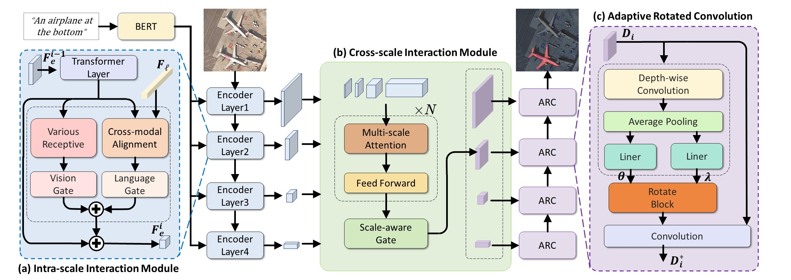

# RMSIN
This repository is the offical implementation for "Rotated Multi-Scale Interaction Network for Referring Remote Sensing Image Segmentation."


## Setting Up
### Preliminaries
The code has been verified to work with PyTorch v1.7.1 and Python 3.7.
1. Clone this repository.
2. Change directory to root of this repository.
### Package Dependencies
1. Create a new Conda environment with Python 3.7 then activate it:
```shell
conda create -n RMSIN python==3.7
conda activate RMSIN
```

2. Install PyTorch v1.7.1 with a CUDA version that works on your cluster/machine (CUDA 10.2 is used in this example):
```shell
conda install pytorch==1.7.1 torchvision==0.8.2 torchaudio==0.7.2 cudatoolkit=10.2 -c pytorch
```

3. Install the packages in `requirements.txt` via `pip`:
```shell
pip install -r requirements.txt
```
### The Initialization Weights for Training
1. Create the `./pretrained_weights` directory where we will be storing the weights.
```shell
mkdir ./pretrained_weights
```
2. Download [pre-trained classification weights of
the Swin Transformer](https://github.com/SwinTransformer/storage/releases/download/v1.0.0/swin_base_patch4_window12_384_22k.pth),
and put the `pth` file in `./pretrained_weights`.
These weights are needed for training to initialize the model.

## Datasets
We perform all experiments on our proposed dataset RRSIS-D. RRSIS-D is a new Referring Remote Sensing Image Segmentation benchmark which contained 17,402 image-caption-mask triplets.  You can get the RRSIS-D dataset from [RRSIS-D]().
### Usage
1. Dowload our dataset.
2. Copy all the downloaded file to `./refer/data/`. The dataset folder should be like this:
```
$DATA_PATH
├── rrsisd
│   ├── refs(unc).json
│   ├── instances.json
└── images
    └── rrsisd
        ├── JPEGImages
        ├── ann_split
        
```
   
## Training
```shell
CUDA_VISIBLE_DEVICES=0,1,2,3 python -m torch.distributed.launch --nproc_per_node 4 --master_port 12345 train.py  --pretrained_swin_weights ./pretrained_weights/swin_base_patch4_window12_384_22k.pth --epochs 40 --img_size 480 2>&1 | tee ./models/output
```

## Testing
```shell
python test.py --split val --window12 --img_size 480
```

## Acknowledgements
Code in this repository is built on [LAVT](https://github.com/yz93/LAVT-RIS). We'd like to thank for open sourcing their project.
